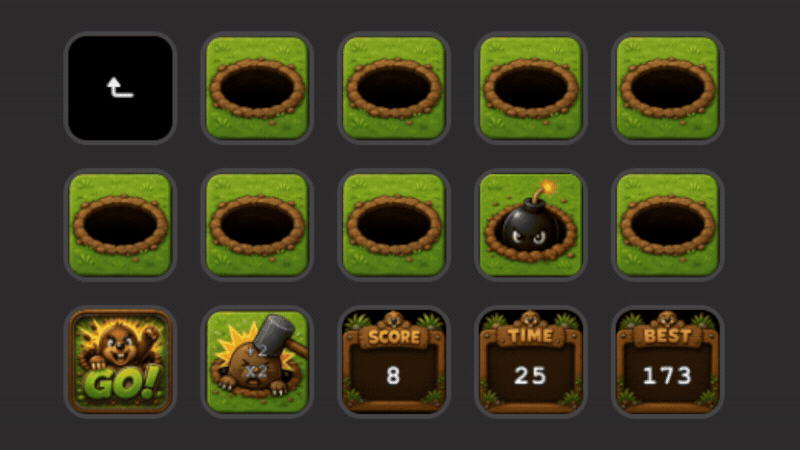

# 🔨 Whack-a-Mole for Elgato Stream Deck

A fully playable Whack-a-Mole mini-game built for the **Elgato Stream Deck** using **TypeScript, Node.js and the Stream Deck SDK**.

The game transforms the physical keys of a Stream Deck into an interactive arcade-style playfield, with moles appearing dynamically across available keys.

## 🎮 Gameplay

Press **START** to begin a 30-second round and whack as many moles as possible before time runs out.

As your score and combo increase, the game becomes progressively faster and more challenging.

### Features

- Randomised mole spawning across Stream Deck keys
- Instant mole replacement after successful hits
- Combo system with increasing score multipliers
- Special fire-mode visuals for high combos
- Golden moles worth bonus points
- Time moles that add extra time
- Bombs that penalise the player and break combos
- Progressive difficulty and increasing bomb frequency
- Final five-second frenzy
- Persistent high-score tracking
- Hold-to-reset high score
- Custom artwork for game states and HUD elements
- Dynamically registered playfield actions

## 🕹️ Stream Deck Layout

The game uses individual Stream Deck actions as components of the playfield.

Hole actions dynamically register themselves with the game, allowing mole spawning to use the currently available playable keys rather than relying on a hard-coded board layout.

This means the underlying game architecture can adapt to different numbers of hole actions.

## 🛠️ Built With

- **TypeScript**
- **Node.js**
- **Elgato Stream Deck SDK**
- **Stream Deck CLI**
- **Rollup**

## 🧠 Technical Highlights

### Dynamic Playfield

Each visible hole action registers itself with the game. A mole can then be randomly assigned to one of the available holes.

This avoids hard-coding individual Stream Deck key positions into the game logic.

### Shared Game State

Game information such as score, remaining time, combo and whether a round is currently running is shared between the different Stream Deck actions.

This allows the SCORE, TIME, BEST, START and playable hole keys to remain synchronised throughout a round.

### Asynchronous Gameplay

Mole appearances and game events use asynchronous timing so that gameplay can continue while Stream Deck actions independently update their displays.

Successful hits can interrupt the current mole timer, allowing another mole to appear immediately rather than waiting for the previous spawn duration to expire.

### Progressive Difficulty

The game dynamically adjusts difficulty during a round.

As the player's score increases:

- Moles appear for shorter periods.
- Bomb probability increases.
- Maintaining a high combo activates fire mode.
- The final five seconds trigger a high-speed frenzy.

### Special Spawn System

Each spawn can become one of several mutually exclusive types:

- Normal Mole
- Golden Mole
- Time Mole
- Bomb

During high-combo fire mode, special moles retain their gameplay identity while receiving unique fire-themed visuals.

## 📸 Demo



Whack-a-Mole running on an Elgato Stream Deck, controlled using the physical Stream Deck keys.

## 🚀 Running the Project

Clone the repository:

```bash
git clone https://github.com/Conor-Magee/streamdeck-whack-a-mole.git
```

Install dependencies:

```bash
npm install
```

Run the development watcher:

```bash
npm run watch
```

The project requires the **Elgato Stream Deck application** and compatible Stream Deck hardware for gameplay.

## 💡 Development

This project began as an experiment with the Stream Deck SDK and dynamically changing key images.

It gradually developed into a complete mini-game as additional systems were introduced, including game-state management, randomised spawning, scoring, persistent data, asynchronous timing, special events and dynamic difficulty.

The project was built iteratively, with features added and refined through repeated play-testing.